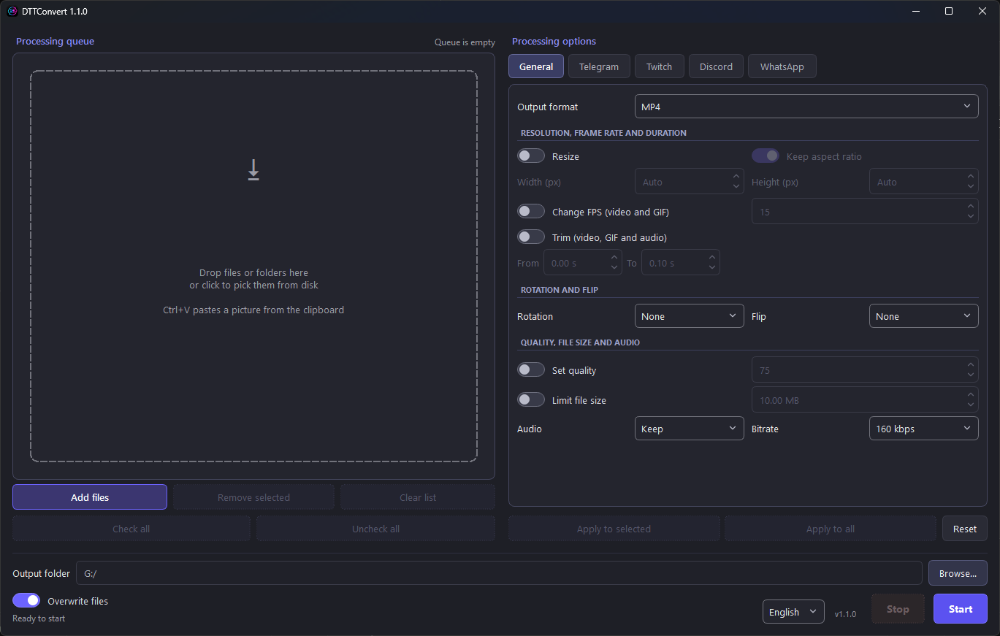

# DTTConvert

**English** · [Русский](README.ru.md)

Converts images, GIFs, videos and stickers for **D**iscord, **T**elegram and
**T**witch, as well as WhatsApp, Kick, YouTube and 7TV. Presets pick the size, frame
rate and file size on their own, so the platform accepts the file on the
first try.

The interface is in English and Russian; switch the language in the
bottom-right corner.



## Download

Windows 10/11, 64-bit — see the [releases](../../releases) page.

| File | What it is |
|---|---|
| `…-with-ffmpeg-setup.exe` | Installer with FFmpeg — the easiest option, no admin rights needed |
| `…-without-ffmpeg-setup.exe` | Installer without FFmpeg — if you already have FFmpeg |
| `…-with-ffmpeg.zip` | Portable, with FFmpeg: unzip and run |
| `…-without-ffmpeg.zip` | Portable, without FFmpeg — the smallest |

The portable version runs straight from the archive; move the **whole
folder** (the `_internal` folder next to the exe is required).

**SmartScreen** ("Windows protected your PC"): the app has no digital
signature. Click "More info" → "Run anyway".

**Without FFmpeg** only images work (JPG, PNG, WEBP, BMP, AVIF). For video,
GIF, stickers and audio, put `ffmpeg.exe` and `ffprobe.exe` next to
`DTTConvert.exe` or install FFmpeg into `PATH`
([Windows builds](https://www.gyan.dev/ffmpeg/builds/)).

## Features

- **Input:** JPG, PNG, APNG, WEBP, BMP, AVIF, HEIC, TIFF, GIF, video
  (MP4, WebM, AVI, MOV, MKV and more) and Telegram animated stickers `.tgs`.
  Animated WEBP, AVIF and APNG are detected by their contents.
- **Output:** JPG, PNG, WEBP, BMP, AVIF, GIF, APNG, MP4, WebM, AVI,
  audio (MP3, M4A, WAV) and frame-by-frame PNG export.
- **Platform presets** — see the table below. The preview shows the result
  right inside a Telegram, Twitch, Discord, WhatsApp, Kick or YouTube chat
  mock-up.
- **Editing:** resize, frame rate, trim, rotate, flip, quality, file size
  limit, keep or drop audio. "Fill the square" crops the edges instead of
  adding transparent margins.
- **Queue:** drag and drop files and folders, paste from the clipboard
  (`Ctrl+V`), per-file settings, parallel processing, CSV report.
  The source file is never overwritten.
- **Links:** paste a link with `Ctrl+V`, drag it from a browser or use
  "Add from a link…" in the queue menu. A direct link to a file works,
  and so does a 7TV, FFZ or Giphy page or any page with a picture.
- **Shortcuts:** `Ctrl+O` — add, `Delete` — remove, `Alt+↑/↓` — reorder,
  `Ctrl+Enter` — start, `Esc` — stop. The whole window works with `Tab`.

## Platform requirements

| Platform | Preset | Format and limits |
|---|---|---|
| Telegram | Sticker | PNG/WEBP, one side 512 px; video — WEBM/VP9, ≤ 3 s, ≤ 30 FPS, ≤ 256 KB, no audio |
| Telegram | Emoji | PNG/WEBP 100×100; video — WEBM, same limits |
| Discord | Sticker | PNG or APNG 320×320, ≤ 512 KB, animation ≤ 5 s |
| Discord | Emoji | PNG or GIF 128×128, ≤ 256 KB |
| Twitch | Emote | PNG/GIF 112×112 or a 28/56/112 set, ≤ 1 MB, GIF ≤ 60 frames |
| Twitch | Sub badge, channel points | PNG, 18/36/72 and 28/56/112 sets, each ≤ 25 KB |
| 7TV | Emote | WEBP or PNG, 128 px high, keeps its proportions up to 3:1, ≤ 7 MB |
| WhatsApp | Sticker | WEBP 512×512, ≤ 100 KB; animated ≤ 10 s, ≤ 500 KB; pack icon PNG 96×96 |
| Kick | Emote, sub badge | PNG 500×500 or GIF 256×256, < 1 MB; badge PNG 36/72 set |
| YouTube | Member emoji, badge | PNG 480×480 and 128×128, < 1 MB (YouTube doesn't animate them) |

A `.tgs` sticker converts to any of these formats, to GIF and to video;
converting back to `.tgs` is not possible — it is a vector format.

## Running from source

Python 3.9+:

```bash
pip install -r requirements.txt
python main.py
```

`pillow-heif` is only needed for HEIC, `rlottie-python` only for `.tgs`.

Tests (`test_core` needs FFmpeg; no windows appear on screen):

```bash
python tests/run_all.py
```

Windows build (needs [PyInstaller](https://pyinstaller.org/); installers
also need [Inno Setup 6](https://jrsoftware.org/isdl.php)):

```powershell
powershell -File build_windows.ps1              # archives with and without FFmpeg in release\
powershell -File build_windows.ps1 -Installer   # plus installers
```

Options: `-Variant with-ffmpeg|without-ffmpeg`, `-FfmpegDir <folder>`, `-NoZip`.
The bundled FFmpeg is checked against `ffmpeg_checksums.txt`.

## Other

- **Version menu** (the version number in the top-right corner): update
  check, file animation, log folder
  (`%LOCALAPPDATA%\DTTConvert\logs\app.log`).
- **Animation:** short animations and videos (up to 10 s) play in queue
  thumbnails and the preview; long videos show a single frame. Turn it off
  in the version menu.
- **Updates:** on every start the app asks GitHub about a new version and
  shows a link in place of the version number. In an installed copy a click
  downloads the installer, checks it and updates the app; a portable copy
  opens the release page. Turn the check off in the version menu.
- **Changelog** — [CHANGELOG.md](CHANGELOG.md).

## Licenses

Code — [MIT](LICENSE). FFmpeg in the bundled build is LGPL/GPL; its license
sits next to the exe (`FFmpeg-LICENSE`). `.tgs` stickers are rendered by
[rlottie-python](https://github.com/laggykiller/rlottie-python) (LGPL 2.1):
its `rlottie.dll` is a separate, replaceable file in `_internal\rlottie_python`,
and the license is `rlottie-python-LICENSE.txt` next to the exe.
